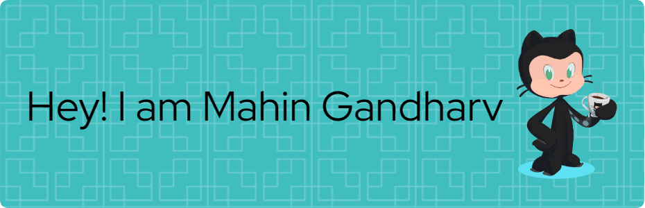

<h1 align="center">Hi 👋, I'm Mahin Gandharv</h1>
<h3 align="center">I am a dedicated learner, currently pursuing a B.Tech in Computer Science and Engineering from Nirma University, Ahmedabad. I am passionate about embracing new technologies and have demonstrated expertise in Machine Learning, Competitive Programming, and Web Development.</h3>

  

- 📫 How to reach me **gandharvmahin11@gmail.com**

- 📄 Know about my experiences [https://drive.google.com/file/d/1Xw4ZW6hHdUIfr-puRoKC5dhzbCdimBKs/view](https://drive.google.com/file/d/1Xw4ZW6hHdUIfr-puRoKC5dhzbCdimBKs/view)

<h3 align="left">Connect with me:</h3>

<h3 align="left">Languages and Tools:</h3>

 
   
   
   
   
   
   
   
   
   
   
   
   
   
   
   

&nbsp;

